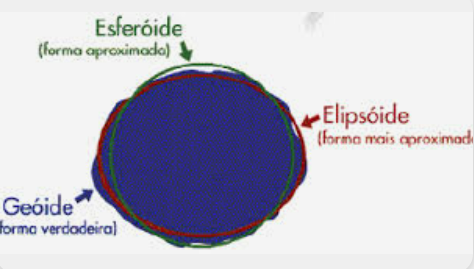
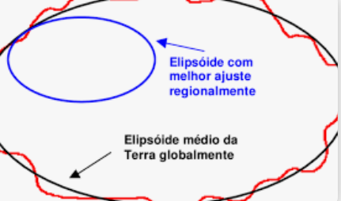
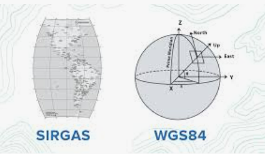
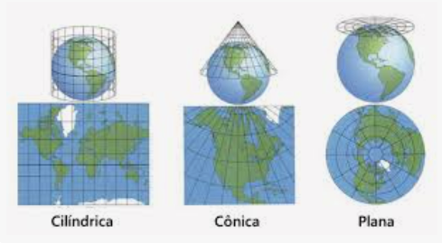
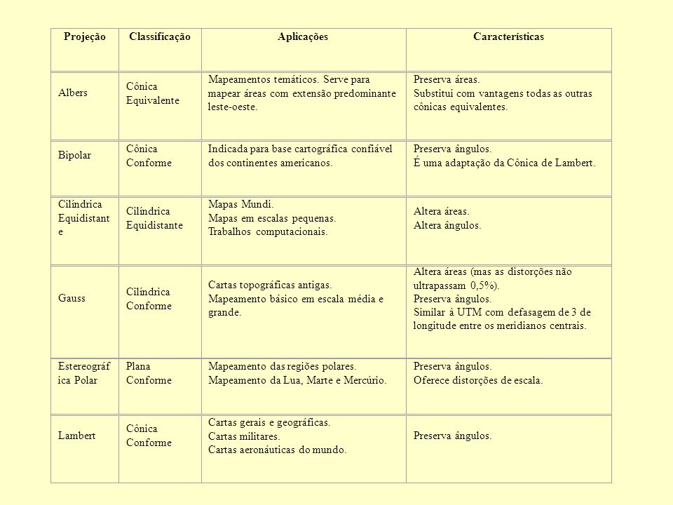
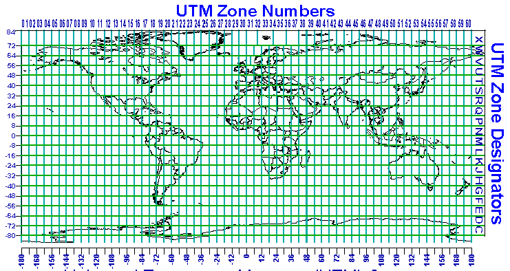

# QUAIS OS SISTEMAS DE REFERÊNCIAS

## GPS GLOBAL POSSITIONING SYSTEM (GPS):

- é normalmente dado em coordenadas geográficas

  - ESSES SISTEMAS EXISTEM PARA TRIANGULAR AS SUAS LOCALIZAÇÕES EM DIFERNTES PONTOS;
  - PRECISAMOS ESTABELECER EM QUAL SISTEMA ESTAMOS

- PRIMEIRO SISTEMA DE REFERÊNCIA:
  - MERIDIANOS EDE LONGITUDE;

```
     |
     |
 W <--->E
     |
     |
```

    - É FORMADO POR UM CONJUNTO DE LATITUDES E LONGITUDES AS UNIDADES DAS LAT LONG É MEDIDA EM GRAUS

- QUANTOS KM DE RAIO A TERRA TEM?

  - **GEODÉSIA QUE EXPLICA**: NEWTON FEZ UM ESTUDO ASSIM COMO PYTAGORAS
  - A TERRA NÃO É UMA ESFERA MAS SIM UMA GEOIDE;
  - TEM HOJE A FORMA DA TERRA COMO UMA GEOIDE;

- APROXIMAÇÃO:
  - ELIPSOIDE DE REFERÊNCIA É UM SISTEMA QUE TENTA REPRESENTAR A TERRA



- QUANDO A GENTE FALA DE LAT LONG A GENTE PODE LEVAR EM CONSIDERAÇÃO DADOS EM CIMA DE REFERÊNCIAS E POR EXEMPLO EM UMA CERTA
  ÁREA DE IMPORTÂNCIA



## SISTEMA MAIS USADO NO BRASIL



- DESDE 25 DE FEVERIERO DE 2015 O BRASILUSA O SISTEMA DE REFERÊNCIA GEOCENTRICO PARA AS AMÉRICAS É O UNICO SISTEMA GEODÉSICA DE REFERÊNCIA OFICIALMENTE ADOTADO NO BRASIL;

- SE PEGAR UMA CARTA MTO ESPECÍFICA NUMA ESCALA MUITO GRANDE ENTÃO;

- É 1 PARA 2000 POR ISSO SE CHAMA SIGRAS 2000

# PROCESSO PARA DEIXAR DADOS NO PLANO

- APROXIMAMOS PARA O DATUM E O ELIPSOIDE DE REFERÊNCIA;

- FAZEMOS A PROJEÇÃO EM UM PLANO



## PROJEÇÃO MAPA

- GEOGRÁFICA PARA PLANA E PLANA PARA GEOGRÁFICA
- X = F_1(PHI,LAMBDA) - Y = F_2(PHI,LAMBDA);
- PHI = G_1(X,Y) - LAMBDA = G_2(X,Y)

- COMO PODEM OCORRER ERROS NA PROJEÇÃO ENTÃO PODEMOS GERAR ALGUNS TIPOS DIFERENTES DE SISTEMAS QUE PODEMS SER UM PLANO UM CONE OU UM CILINDRO



- SE ESCOLHE AS PROJEÇÕES DOS SISTEMAS DE PROJEÇÀO COM BASE NAS INFORMAÇÕES QUE SE QUER PRESERVAR;

- DEPENDENDO DO MAPA A ANTÁRTICA PODE SER PEQUENA OU GRANDE;

- ISSO TUDO DEPENDE DO TIPO DE MAPA ESCOLHIDO;

## EXEMPLO DE UTM

- É MUITO USADO DIVIDE O PLANETA EM 60 ZONAS;

- UNIDADE É METRO E ELA VAI ATÉ MAIS OU MENOS 80 GRAUS DE LAT LONG E A CIMA DISSO TEM UMA DISTORÇÃO;

;

## como descrever um sistema de resferência espacial(SRS)

- WKT (WELL KNOWN TEXT FOR SRS);
- OCG (OPEN GEOSPACIAL CONSERTION);
- PADRONIZAR PARA QUE O SISTEMA POSSA LER E DECODIFICAR AS INFORMAÇÕES QUE ENTRAM NO SISTEMA;
- SE EU ERRAR UMA LETRA EU PERCO UMA INFORMAÇÃO;
- SE EU PEGAR CÓDIGO E INCAPSULAR DADOS EM VARIÁVEIS **AUTORIDADE**
- SRSID = [EPSG](https://epsg.io/) É UMA AUTORIDADE QUE DÁ VALORES DE POSIÇÃO E SÃO ORGANIZADOS PARA DIFERENTES
- EPSG (European Petroleum Survey Group) é uma organização que mantém um banco de dados de sistemas de referência espacial, incluindo projeções cartográficas, sistemas de coordenadas e transformações de coordenadas. Os códigos EPSG são amplamente utilizados em sistemas de informação geográfica (SIG) e geodésicos para identificar e referenciar diferentes sistemas de coordenadas.
- POR DEFAULT É EPSG 4326 (EM TEMPO DE DESENHO ELE PODE REPRESENTAR EM OUTRO)

## bALDING BOX É O MENOR QUADRADO QUE ENQUADRE A SUPERFÍCIE

- é uma área que precisa ser georreferênciada;
