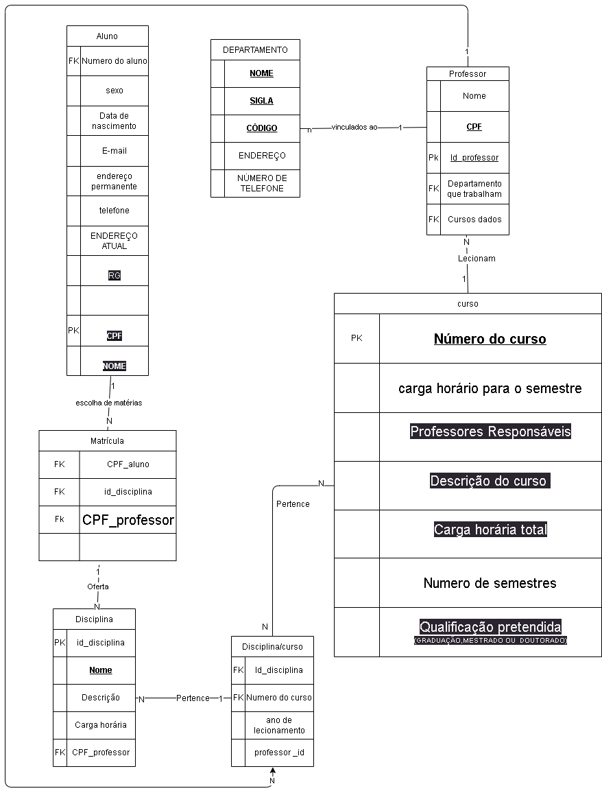

## Tarefa 02

- indiar as chaves primarias as chaves estrangeiras de todas as tabelas ou relações assim como outras constraints que devem ser geradas

- toda vez que temos uma relação n para n a gente tem que criar uma relaçào intermediaria

