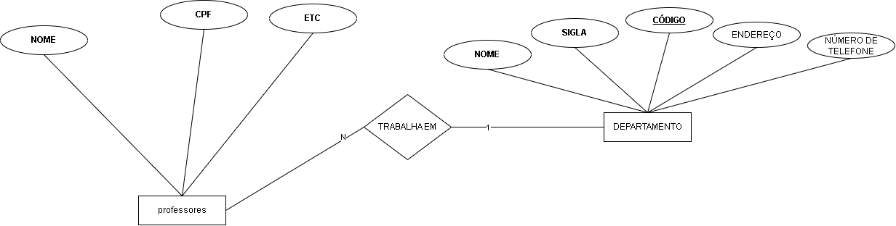
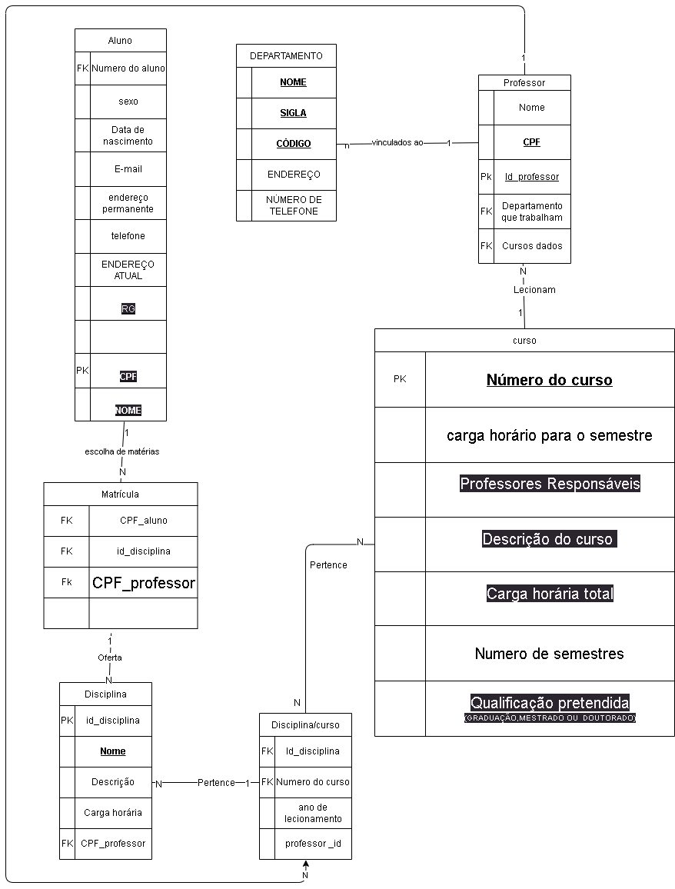

# Lista 01 Sistem a de banco de dados

## Exercício 01

- Diagrama de um aluno e suas chaves

- Diagrama de Um departamento com os professores associados

- Diagrama de Um curso com as suas caracteristicas

- Diagrama completo

## Tarefa 02

- indiar as chaves primarias as chaves estrangeiras de todas as tabelas ou relações assim como outras constraints que devem ser geradas

- toda vez que temos uma relação n para n a gente tem que criar uma relaçào intermediaria

## Tarefa 03

## Em um modelo relacional, o que é restrição de integridade referencial?

É uma restrição que diz que se eu for referênciar uma tupla em outra tupla a tupla original não pode ter nulo na xoluna que será instanciada

## Indique quais são as chaves estrangeiras (Foreign Keys) do diagrama da Figura 1 e quais colunas e tabelas elas associam.

_Em matrícula_ Aluno id e cuso id são chaves estrangeiras e vêm dos bancos aluno e curso respectivamente

_Em curso_ Escola_id é chhave estrangeira e vem da tabela escola

## A tabela Matricula pode conter matrículas de um mesmo aluno em um mesmo curso mais de uma vez? Por que?

Visto que existe a coluna Ano_matricula caso seja possível o aluno continuar no curso mesmo que reprovando matérias, então pode sim. Pois um mesmo aluno poderia reprovar em uma matéria e assim constariam duas veses o mesmo aluno idd para o mesmo curso id. Porém, a Nota seria difernte e o ano_matrícula tambêm. Portanto, seria interessante assumir uma concatenação dessa duas colunas para ser a chave primária.

## Se todas as chaves estrangeiras do diagrama forem criadas com a ação “ON DELETE CASCADE” e “ON UPDATE CASCADE”, o que acontece se:

- Eu remover o curso “XXX” da tabela Curso?

Esse curso será deletado tambem na tabela matrícula e portanto as tuplas vinculadas a ele seram todas apagadas

- Eu alterar o nome do curso “XXX” para “YYY” na tabela Curso?

Tambem será feito o update do curso_id na tabela matrícula.

- Eu remover o aluno “ZZZZ” da tabela Aluno?

Todas as tuplas vinculadas a ele tambêm seram deletadas da tabela matrícula

- Eu remover a escola “EEEE” da tabela Escola?

Ai todas as tuplas da aba curso vinculadas a essa escola seram deletado
