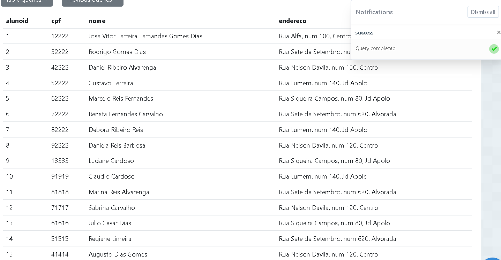

# Lista 2 Banco de Dados

- Aluno: Daniel Farkat
- Matrícula: 166106/2024

## Questão 1:

Usando os scripts SQL do arquivo “lista_02_sql.sql”, crie as tabelas Instrutor, Aluno, Escola e Curso.

**Instrutor**

```
CREATE TABLE Instrutor (
InstrutorID INT NOT NULL,
CPF INT NOT NULL UNIQUE,
Nome VARCHAR( 30 ) NOT NULL,
Endereco VARCHAR( 60 ),
CONSTRAINT InstrutorPK PRIMARY KEY (InstrutorID)
);
```


**Aluno**

```
CREATE TABLE Aluno (
    AlunoID   		INT   			NOT NULL,
    CPF				INT				NOT NULL  UNIQUE,
    Nome  			VARCHAR( 30 )  	NOT NULL,
    Endereco   		VARCHAR( 60 ),
    CONSTRAINT AlunoPK PRIMARY KEY (AlunoID)
);
```

- Tive que alterar o tamanho da char para caber pessoas com nomes maiores e endereços grandes

```
ALTER table Aluno ALTER Column Nome TYPE VARCHAR(80);
ALTER table Aluno ALTER Column Endereco TYPE VARCHAR(150);
```


**Escola**

```
CREATE TABLE Escola (
    EscolaID   		INT   			NOT NULL,
    CNPJ			INT				NOT NULL  UNIQUE,
    Nome  			VARCHAR( 30 )  	NOT NULL,
    Endereco   		VARCHAR( 60 ),
    CONSTRAINT EscolaPK PRIMARY KEY (EscolaID)
);
```


**Curso**

```
CREATE TABLE Curso (
    CursoID   		INT   			NOT NULL,
    Nome  			VARCHAR( 30 )  	NOT NULL,
    Carga_horaria	INT 			NOT NULL,
    Ementa			VARCHAR( 500 )	,
    EscolaID        INT 			NOT NULL,

    CONSTRAINT CursoPK PRIMARY KEY (CursoID),

    CONSTRAINT CursoEscolaFK 	FOREIGN KEY (EscolaID)
    							REFERENCES Escola(EscolaID)
    							ON DELETE CASCADE
    							ON UPDATE CASCADE
);
```


## Questão 2

**Turma**

```
CREATE TABLE Turma(
    TurmaID INT NOT NULL,
    CursoID INT NOT NULL,
    InstrutorID INT NOT NULL,
    DataInicio DATE,
    DataTermino DATE,

    PRIMARY KEY(TurmaID),

    CONSTRAINT CursoTurmaFK FOREIGN KEY (CursoID) REFERENCES Curso(CursoID)
                                ON DELETE CASCADE
                                ON UPDATE CASCADE,

    CONSTRAINT InstrutorTurmaFK FOREIGN KEY (InstrutorID) REFERENCES Instrutor(InstrutorID)
                                ON DELETE CASCADE
                                ON UPDATE CASCADE
);

```


**Matrícula**

```
CREATE TABLE Matricula(
    TurmaID INT NOT NULL,
    AlunoID INT NOT NULL,
    Nota_final NUMERIC(4,2) NOT NULL,
    PRESENCA INT NOT NULL,

    PRIMARY KEY(TurmaID, AlunoID),

    CONSTRAINT MatriTurmaFK FOREIGN KEY (TURMAID) REFERENCES Turma(TurmaID),

    CONSTRAINT AlunoTurmaFK FOREIGN KEY (AlunoID) REFERENCES Aluno(AlunoID)
);
```


## Questão 3

**Usando os scripts SQL do arquivo “lista_02_sql.sql”, insira os registros da tabela Instrutor. Ocorreu algum erro? Por que? Como resolver?**

Visto que a coluna _CPF_ é do tipo constraint.Foram colocados o mesmo valor para dois usuários diferentes do banco. Portanto apareceu um erro ao tentar colocar o mesmo _CPF_ para diferentes usuários. Dessa forma seria aconcelhado alterar o valor da coluna _CPF_ de _33333_ para o correto como por exemplo _44444_ como pode ser visto a baixo.

```
INSERT INTO Instrutor VALUES(3, 44444, 'Leandro Siqueira', 'Rua Nelson Davila, num 120, Centro');
```


## Questão 4

**Usando os scripts SQL do arquivo “lista_02_sql.sql”, insira os registros da tabela Aluno. Ocorreu algum erro? Por que? Como resolver? Mostre o comando SQL para resolver o problema encontrado**

O erro foi quanto as dimensões das vorchars. Portanto, foram alteradas para dimensões consideradas mais corretas como pode ser visto a baixo:

```
ALTER table Aluno ALTER Column Nome TYPE VARCHAR(80);
ALTER table Aluno ALTER Column Endereco TYPE VARCHAR(150);
```

resultando no que pode ser visto na imagem


