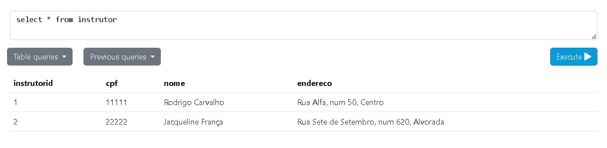
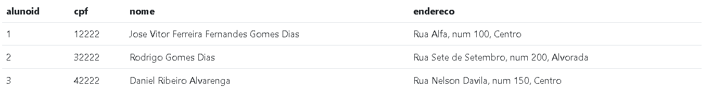

# Lista 2 Banco de Dados

- Aluno: Daniel Farkat
- Matrícula: 166106/2024

## Questão 1:

Usando os scripts SQL do arquivo “lista_02_sql.sql”, crie as tabelas Instrutor, Aluno, Escola e Curso.

**Instrutor**

```
CREATE TABLE Instrutor (
InstrutorID INT NOT NULL,
CPF INT NOT NULL UNIQUE,
Nome VARCHAR( 30 ) NOT NULL,
Endereco VARCHAR( 60 ),
CONSTRAINT InstrutorPK PRIMARY KEY (InstrutorID)
);
```



**Aluno**

```
CREATE TABLE Aluno (
    AlunoID   		INT   			NOT NULL,
    CPF				INT				NOT NULL  UNIQUE,
    Nome  			VARCHAR( 30 )  	NOT NULL,
    Endereco   		VARCHAR( 60 ),
    CONSTRAINT AlunoPK PRIMARY KEY (AlunoID)
);
```

- Tive que alterar o tamanho da char para caber pessoas com nomes maiores e endereços grandes

```
ALTER table Aluno ALTER Column Nome TYPE VARCHAR(80);
ALTER table Aluno ALTER Column Endereco TYPE VARCHAR(150);
```



**Escola**

```
CREATE TABLE Escola (
    EscolaID   		INT   			NOT NULL,
    CNPJ			INT				NOT NULL  UNIQUE,
    Nome  			VARCHAR( 30 )  	NOT NULL,
    Endereco   		VARCHAR( 60 ),
    CONSTRAINT EscolaPK PRIMARY KEY (EscolaID)
);
```


**Curso**

```
CREATE TABLE Curso (
    CursoID   		INT   			NOT NULL,
    Nome  			VARCHAR( 30 )  	NOT NULL,
    Carga_horaria	INT 			NOT NULL,
    Ementa			VARCHAR( 500 )	,
    EscolaID        INT 			NOT NULL,

    CONSTRAINT CursoPK PRIMARY KEY (CursoID),

    CONSTRAINT CursoEscolaFK 	FOREIGN KEY (EscolaID)
    							REFERENCES Escola(EscolaID)
    							ON DELETE CASCADE
    							ON UPDATE CASCADE
);
```


